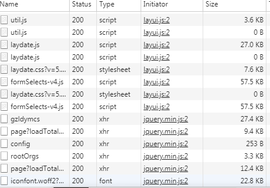
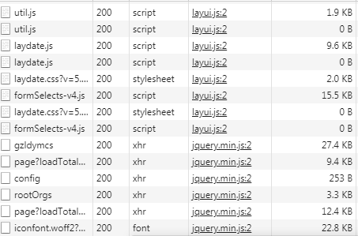

# Gzip 资源压缩详解
>前景：用户打开页面空白等待时间过长导致用户体验较差。 页面数据有的资源或数据过大，在网络传输过程中耗时较长。
>解决方案：采用 Gzip 压缩技术，将资源与数据进行压缩，减少网络传输过程中的耗时，提高用户体验

## 对比
- 未使用 Gzip 压缩



- Gzip 压缩



## 配置
- SpringBoot 配置 Gzip
```yaml
server:
    compression:
        //是否开启文件压缩
        enabled: true
        //指定需要压缩的文件格式
        mime-types: text/html, text/css, text/javascript, application/javascript
        // 指定最小压缩文件的大小 
        min-response-size: 1024      
```

- Tomcat 配置 Gzip
在 server.xml 中，在 Connector 标签中加入如下属性
```xml
<Connector port="8080" protocol="HTTP/1.1" connectionTimeout="20000"
               redirectPort="8443" URIEncoding= "UTF-8"
               compression="on" compressionMinSize="2048"
               compressableMimeType="text/html,text/css,text/javascript"  />
```

- Nginx 配置 Gzip
```nginx
gzip on;
# 不压缩临界值，大于 1k 才进行压缩
gzip_min_length 1k;
# 设置系统获取几个单位的缓存用于存储 gzip 的压缩结果数据流。 例如 4 4k 代表以 4k 为单位，按照原始数据大小以 4k 为单位的 4 倍申请内存。 4 8k 代表以 8k 为单位，按照原始数据大小以 8k 为单位的 4 倍申请内存。  
# 如果没有设置，默认值是申请跟原始数据相同大小的内存空间去存储 gzip 压缩结果。
gzip_buffers 4 16k;
# 使用了反向代理的话，末端通信是 HTTP/1.0。默认是 HTTP/1.1
#gzip_http_version 1.0;
# 压缩等级，等级越高压缩越好
gzip_comp_level 2;
#需要压缩的文件格式
gzip_types text/plain application/x-javascript text/css application/xml text/javascript;
#给CDN和代理服务器使用，针对相同 url，可以根据头信息返回压缩和非压缩副本  
gzip_vary off; 
```