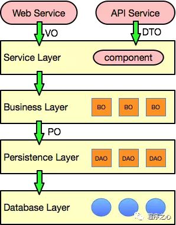

# POJO 详解
## VO (Value Object) 
>显示层对象，通常是Web向模板渲染引擎层传输的对象

与前端进行交互的 java 对象。VO 只包含前端需要展示的数据，对于前端不需要的数据，减少传输数据量大小和保护数据库结构不外泄的目的，不应该在 VO 中体现出来。通常遵守 Java Bean 的规范，拥有 getter/setter 方法。
 
## DTO (Data Transfer Object)
>数据传输层对象

DTO 通常用于不同服务或服务不同分层之间的数据传输。DTO 与 VO 概念相似，并且通常情况下字段也基本一致。但 DTO 与 VO 又有一些不同，这个不同主要是设计理念上的，比如 API 服务需要使用的 DTO 就可能与 VO 存在差异。通常遵守 Java Bean 的规范，拥有 getter/setter 方法。

## DO (Data Object)
>领域对象

从现实世界中抽象出来的有形或无形的业务实体。一般和数据中的表结构对应。与数据库表结构一一对应，通过DAO层向上传输数据源对象。

## QO (Query Object)
>查询对象

用于组装查询参数

## BO (Bussiness Object)
>业务对象，由 Service 层封装的业务逻辑的对象

代表业务对象的意思，Bo就是把业务逻辑封装为一个对象（注意是逻辑，业务逻辑），这个对象可以包括一个或多个其它的对象。通过调用Dao方法，结合Po或Vo进行业务操作

## PO (Persistant Object)
>持久对象、数据

用于表示数据库中的一条记录映射成的 java 对象。PO 仅仅用于表示数据，没有任何数据操作。通常遵守 Java Bean 的规范，拥有 getter/setter 方法。

