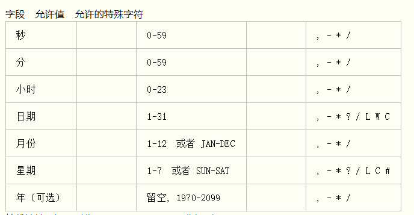

# Cron 定时器表达式
> 0 0 12 * * ?  每天中午12点触发
#### Spring cron 表达式分为两种
- 6 位长度: ( 秒 分 时 日 月 星期 )
- 7 位长度:  ( 秒 分 时 日 月 星期 年 )

#### 符号释义
      '-'  连续区间（9-12）指9点至12点
      '/'  间隔时间（8-18/4）表示间隔固定时间执行，前面数字带面开始与结束时间，'/'后面表示间隔时间
      ','  多个数字采用','隔开
      '?'  日期与星期互斥，所有两个元素之间，其中一个需要为 '？'

#### 简单实例
      每隔5秒执行一次：      */5 * * * * ?
      每隔1分钟执行一次：   0 */1 * * * ?
      每天23点执行一次：     0 0 23 * * ?
      每月1号凌晨1点执行一次：          0 0 1 1 * ?
      每月最后一天23点执行一次：       0 0 23 L * ?
      每周星期天凌晨1点实行一次：      0 0 1 ? * L
      在26分、29分、33分执行一次：   0 26,29,33 * * * ?
      每天的0点、13点、18点、21点都执行一次：  0 0 0,13,18,21 * * ?